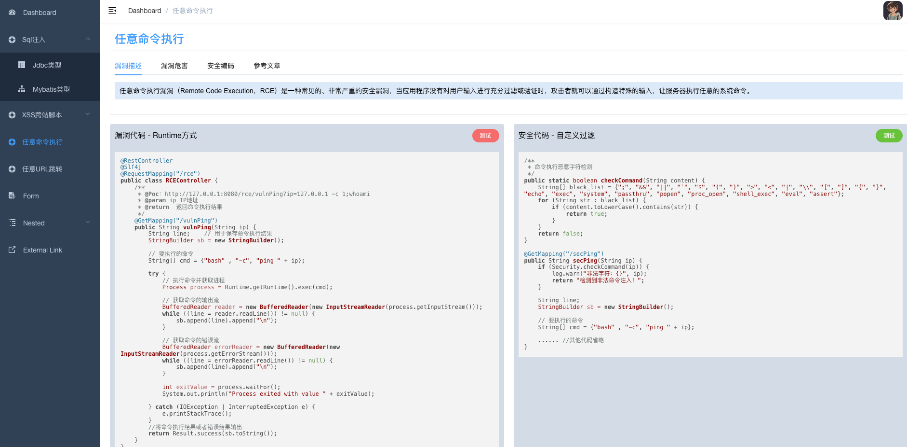

# SpringVulnBoot Frontend

当前前端项目是SpringVulnBoot靶场项目的前端工程，后端工程地址是：[https://github.com/bansh2eBreak/SpringVulnBoot-backend](https://github.com/bansh2eBreak/SpringVulnBoot-backend)

本次更新（2025/01/21）：
- 增加了登录认证，通过spring框架的Interceptor+WebMvcConfigurer配置类实现登录校验
- 实现了管理员登录Jwt会话的生成和验证逻辑
- 抛弃原始前端框架的Cookie技术，改为从LocalStorage中读写
- 完成前端登录后的头像获取
- 增加了任意命令执行和任意URL跳转漏洞

靶场已编写的漏洞有：
- SQLi注入
- XSS跨站脚本
- 任意命令执行
- 任意URL跳转

未完待续：
- 文件上传漏洞
- SSRF漏洞
- CSRF漏洞
- 逻辑漏洞
- 业务漏洞
- ...

Tips：对于不熟悉前端框架的人来说，这个简直就是福音，基于 vue-admin-template 进行简单的改改改就可以形成好看的前端页面。下面是 vue-admin-template 官网和简介。

# vue-admin-template

> 这是一个极简的 vue admin 管理后台。它只包含了 Element UI & axios & iconfont & permission control & lint，这些搭建后台必要的东西。

[线上地址](http://panjiachen.github.io/vue-admin-template)

[国内访问](https://panjiachen.gitee.io/vue-admin-template)
