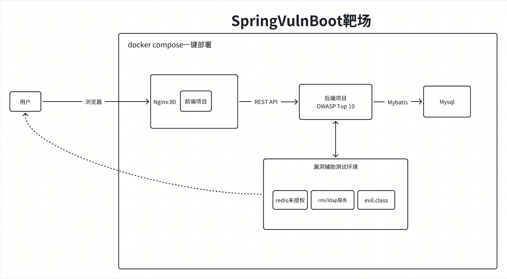

# SpringVulnBoot Frontend

## 项目介绍

基于 Vue + SpringBoot 构建的 Java 安全靶场，一个专为安全爱好者、渗透测试和代码审计人员打造的实战演练平台。

[前端工程](https://github.com/bansh2eBreak/SpringVulnBoot-frontend)是基于流行的vue-admin-template基础模板进行改改改，[后端工程](https://github.com/bansh2eBreak/SpringVulnBoot-backend)是基于JDK11+SpringBoot 2.7.14开发的。

## 部署方式

本项目前后端分离，需与后端工程一同部署，请移步[后端工程](https://github.com/bansh2eBreak/SpringVulnBoot-backend)查看部署说明。
