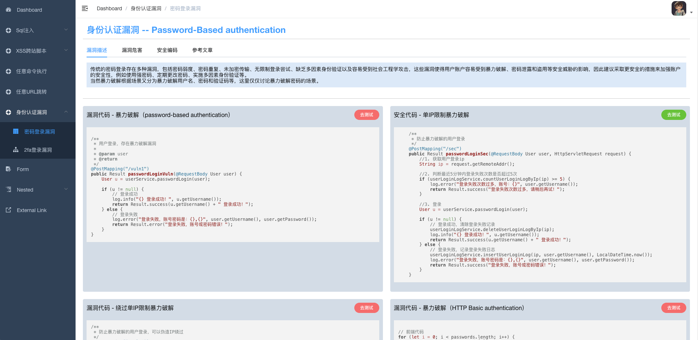
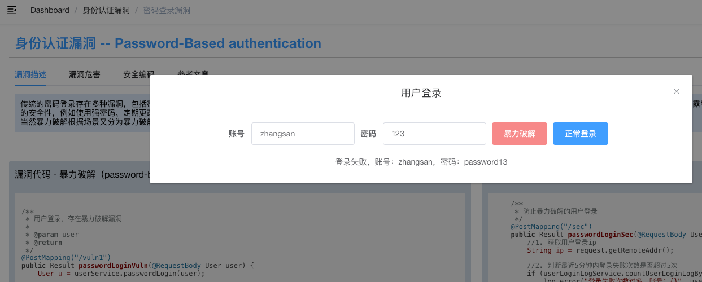
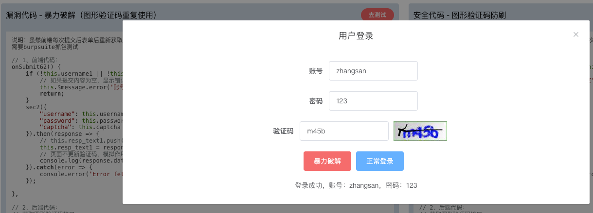

# SpringVulnBoot Backend

## 项目介绍
SpringBoot靶场后端工程：SpringVulnBoot-backend

通过Springboot打造的java安全靶场，尽可能编写出各种常见的漏洞，供大家学习和测试。 

1. 前端是基于流行的vue-admin-template基础模板进行改改改，[前端工程](https://github.com/bansh2eBreak/SpringVulnBoot-frontend)
2. 后端是基于springboot开发的，[后端工程](https://github.com/bansh2eBreak/SpringVulnBoot-backend)

## 效果图

本次更新（2025/02/08）：
- 增加身份认证漏洞-密码登录暴力破解漏洞，包括普通的账号密码登录、HTTP Basic认证登录、带图形验证码登录几种场景。

靶场已编写的漏洞有：
- SQLi注入
- XSS跨站脚本
- 任意命令执行
- 任意URL跳转
- 身份认证漏洞 
  - 密码登录-暴力破解（包含图形验证码的漏洞）

未完待续：
- 文件上传漏洞
- SSRF漏洞
- CSRF漏洞
- 逻辑漏洞
- 业务漏洞
- ...

说明：对于不熟悉前端框架的人来说，基于 vue-admin-template 进行简单的改改改就可以形成好看的前端页面。下面是 vue-admin-template 官网和简介。

## vue-admin-template

> 这是一个极简的 vue admin 管理后台。它只包含了 Element UI & axios & iconfont & permission control & lint，这些搭建后台必要的东西。

[线上地址](http://panjiachen.github.io/vue-admin-template)

[国内访问](https://panjiachen.gitee.io/vue-admin-template)
